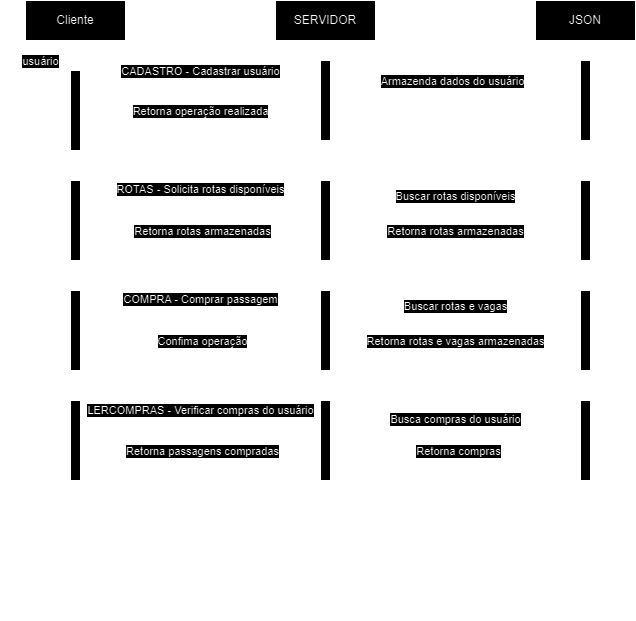
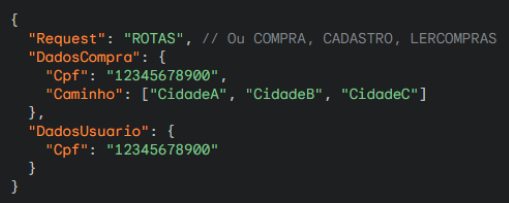

# Sistema de Compra de Passagens Aéreas
> Grupo:
> - Júlia Carneiro Gonçalves de Souza.
> - Thiago Souza Rodrigues.

Descrição do problema disponível em: [TEC502 - Problema 1 - Venda de Passagens.pdf](https://github.com/user-attachments/files/16853459/TEC502.-.Problema.1.-.Venda.de.Passagens.-.Versao.2.pdf)

## Introdução

Este projeto foi desenvolvido para implementar a comunicação entre cliente e servidor no contexto de compra e venda de passagens aéreas no setor de aviação de baixo custo (low-cost carriers - LCC). O sistema torna possível o processo de compra de passagens, utilizando o protocolo TCP/IP e uma API desenvolvida em Go, com suporte para múltiplas conexões simultâneas. A aplicação está contida em containers Docker, que isolam e orquestram a execução dos serviços.
Em resumo, o servidor gerencia as rotas disponíveis, a compra de passagens e o cadastro de usuários. Ele é responsável por validar as transações de compra, checando a disponibilidade de vagas em cada rota solicitada, e tratando o armazenamento dessas informações. O cliente, por outro lado, permite ao usuário solicitar rotas, realizar compras e consultar suas compras anteriores.

## Metodologia

A metodologia abordada foi a partir da construção de fluxogramas e diagramas de sequência da comunicação e fluxo do programa, juntamente com sessões de discussão e desenvolvimento em grupo sobre o problema. Serão abordados nesta sessão tópicos de alta importância para o desenvolvimento do projeto. 

### Arquitetura do Projeto

A arquitetura está dividida em dois principais componentes: o servidor e o cliente.Ambos estão encapsulados em um container Docker e se comunicam através de uma rede interna.

#### Servidor
O servidor é responsável por gerenciar as seguintes funcionalidades:
- Cadastro de usuários.
- Validação e registro de compra de passagens.
- Consulta de rotas disponíveis.
- Persistência de dados em arquivo JSON.
- O servidor escuta as requisições na porta TCP configurada, que é exposta através do Docker.

#### Cliente
O cliente permite que os usuários:
- Ver cidades disponíveis
- Consultem rotas.
- Realize compra de passagens.
- Consulte suas compras anteriores.

O cliente se conecta ao servidor utilizando o endereço IP do container do servidor (configurado via Docker Compose) e envia solicitações que seguem um protocolo de comunicação específico.
Além disso, foram criadas funções de busca em profundidade para retornar os caminhos possíveis das rotas solicitadas pelo usuário. 

### Paradigma de Comunicação

O sistema utiliza o paradigma de comunicação síncrono com o protocolo de comunicação TCP. O cliente envia uma requisição para o servidor, que a processa e retorna uma resposta. 
A comunicação é orientada a conexão, garantindo que pacotes de dados sejam entregues de forma confiável, sem perdas ou duplicações, o que é fundamental em um sistema que envolve transações como a compra de passagens. 
É possível definir a aplicação como **Stateless**, já que os dados da conexão não são armazenados - cada requisição é como se fosse uma nova sessão para o servidor. 

### Protocolo de Comunicação

A comunicação entre cliente e servidor segue um protocolo baseado em mensagens JSON, que encapsulam as requisições e respostas trocadas entre os dois. O formato JSON foi escolhido por ser leve, legível e amplamente utilizado em sistemas de comunicação de rede. As principais operações suportadas são:

As principais operações suportadas são:

- **ROTAS**: O cliente solicita a lista de rotas disponíveis, e o servidor responde com as informações das rotas e suas respectivas vagas.
- **COMPRA**: O cliente solicita a compra de um trecho de rota, e o servidor valida a solicitação, ajusta o número de vagas disponíveis e persiste a compra no arquivo de dados.
- **CADASTRO**: O cliente cadastra um novo usuário no sistema.
- **LERCOMPRAS**: O cliente solicita a leitura das compras feitas pelo usuário.

    

### Formatação e Tratamento de Dados

O JSON foi escolhido como formato de dados por sua simplicidade, flexibilidade, leiturabilidade e ampla adoção. Essas características tornam-o ideal para a troca de dados entre diferentes sistemas e linguagens de programação, garantindo a interoperabilidade e a facilidade de desenvolvimento.
Sendo assim, as mensagens estão sendo enviadas neste formato e seguem o seguinte padrão:

    

Ademais, para garantir a persistência dos dados, as informações sobre usuários, rotas e compras também foram armazenadas em arquivos JSON, devido a simplicidade na leitura e escrita.

### Tratamento de Conexões Simultâneas

O servidor foi projetado para suportar múltiplas conexões simultâneas, utilizando **goroutines**, que são leves e eficientes para concorrência no Go. Para cada nova conexão, uma goroutine é criada para processar as mensagens do cliente, permitindo que o servidor continue aceitando outras conexões em paralelo.

O uso de goroutines garante que o servidor atenda a múltiplos clientes simultaneamente, sem impactar a experiência dos demais usuários.

### Tratamento de Concorrência

Para gerenciar o acesso concorrente à função que valida as compras e gerencia as vagas, foi implementado o uso de um mutex (mutual exclusion). O mutex permite que apenas uma goroutine acesse a função ao mesmo tempo, bloqueando outras goroutines até que a primeira complete sua execução. Esse controle é crucial, especialmente em cenários onde múltiplos usuários podem tentar comprar o mesmo trecho de uma rota que possui vagas limitadas.

A utilização do mutex foi realizada da seguinte maneira:

**Bloqueio do Mutex:** Antes de executar a lógica de validação, a goroutine chama mu.Lock(), que impede que outras goroutines entrem na função enquanto uma instância dela estiver em execução.

**Operação Crítica:** A lógica de validação e atualização das vagas disponíveis ocorre dentro da seção crítica, garantindo que os dados não sejam corrompidos por acessos simultâneos.

**Desbloqueio do Mutex:** Após a conclusão da operação, mu.Unlock() é chamado para liberar o mutex, permitindo que outras goroutines possam acessar a função.

Com essa abordagem, é possível garantir que a validação de compras ocorra de maneira segura e eficiente, evitando problemas como a venda excessiva de vagas e mantendo a integridade do sistema como um todo.

## Resultados e Testes
Os principais testes foram voltados para a conectividade e concorrência, sendo feitos na maioria das vezes de forma manual com a criação de diversos terminais distintos e a realização de operações de forma simultânea. 

Além disso, foram necessários testes para concluir que o funcionamento da busca em profundidade estava satisfatório, sendo assim, várias simulações de compras foram executadas - sendo elas rotas compostas ou diretas.

Questões como compras duplicadas e verificação de vagas disponíveis também foram levadas em consideração e testadas. Com todos os testes realizados, garantiu-se o funcionamento desejado da aplicação, permitindo que o usuário a utilize com êxito. 
 
## Conclusão 
A partir da realização desse projeto, é possível compreender os princípios básicos de concorrência e conectividade, contemplando o funcionamento do protocolo TCP/IP, a containerização de sistemas utilizando o Docker. 

Além disso, foi possível desenvolver habilidades práticas na implementação de um sistema cliente-servidor, aprimorando o entendimento sobre como gerenciar conexões simultâneas e a importância do tratamento adequado de dados e erros. 
A experiência em trabalhar com algoritmos para busca de caminhos em grafos também contribuiu para uma visão mais ampla sobre a otimização de rotas e a tomada de decisões em tempo real em aplicações de transporte.

Dessa maneira, conclui-se que a aplicação teve resultados positivos, cumprindo todos os requisitos solicitados no problema inicial.

--- 

